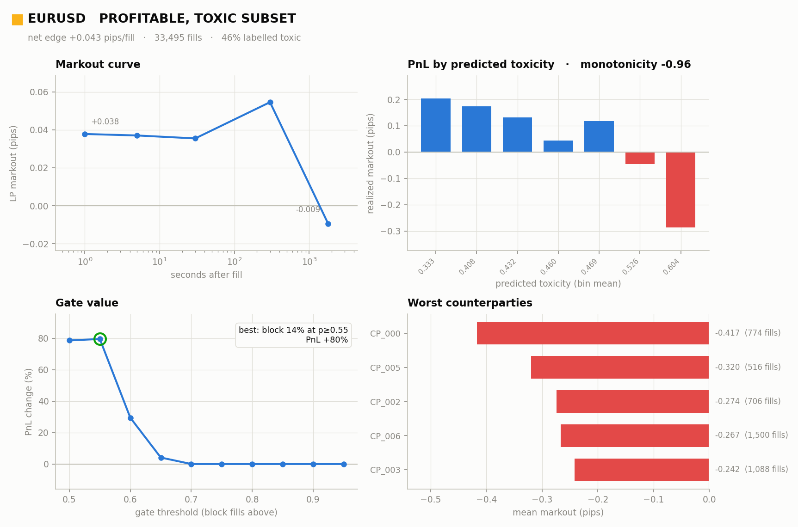

# Strat-Sandbox

An FX toxic-flow detector: it measures adverse selection in a market-making book
and runs a quoting gate that widens or pulls quotes when incoming flow looks
informed. Research is done in Python; the latency-critical path is C++17.



## What it does

A nine-phase pipeline, run end to end by [src/run_pipeline.py](src/run_pipeline.py):

1. **Ingest and clean**: load ticks from Dukascopy, duka, TrueFX or HistData, or
   generate synthetic data. Drop crossed quotes and flag gaps.
2. **Blotter**: load a fill blotter, or simulate one from the ticks (`lp`, `ma`
   or `random` book).
3. **VPIN and markouts**: streaming volume-bucketed VPIN with bulk volume
   classification, LP markouts at several horizons, and an adverse-selection
   decay curve fit (`alpha_mu`, `lambda`).
4. **Labelling**: crossback, triple-barrier or markout-threshold toxicity labels.
5. **Features**: pre-trade features (VPIN percentile, spread, realized vol, tick
   rate, counterparty history, fractionally differenced series), followed by
   forward feature selection scored on Brier skill.
6. **Model**: a calibrated logistic regression or LightGBM classifier, trained
   with purged cross-validation.
7. **Integration**: a quoting gate with hysteresis and dwell. Its spread is
   `2 · alpha_mu · P(toxic)`.
8. **Export**: write the model to a `.fxm` file, which the C++ engine loads by
   feature name.
9. **Monitoring**: track drift and the value the gate adds.

The run prints a verdict and writes four charts to `toxicity_report.png`.

## Setup

```bash
git clone https://github.com/nucleartoby/Strat-Sandbox.git
cd Strat-Sandbox
pip install -r requirements.txt

# optional: build the C++ core. Without it, everything runs on the NumPy reference, just slower.
brew install libomp                       # macOS, for LightGBM
cmake -S . -B build -DCMAKE_BUILD_TYPE=Release
cmake --build build -j
```

The extension builds into `src/`, so `import fxtox_native` works without an
install step.

## Usage

```bash
# synthetic data, all nine phases
python src/run_pipeline.py

# real EUR/USD from Dukascopy, simulated LP book, labels tuned for fast latency-arb bleed
python src/run_pipeline.py --symbol EURUSD --start 2024-01-02 --end 2024-01-05 \
       --simulate lp --label-rule markout_threshold --label-horizon 30

# your own ticks and fills, exporting the trained model
python src/run_pipeline.py --ticks EURUSD.csv --provider dukascopy \
       --blotter fills.csv --export model.fxm

# build a fill blotter on its own (writes my_fills.csv)
python src/make_blotter.py --symbol EURUSD --start 2024-01-02 --end 2024-01-05 --mode lp

# realtime engine: stream ticks through VPIN, features and the gate
./build/vpin_realtime --bucket-volume 3e6 --model model.fxm < ticks.csv
```

A blotter CSV has the columns `timestamp,side,price,size,counterparty_id`.

## License

MIT
